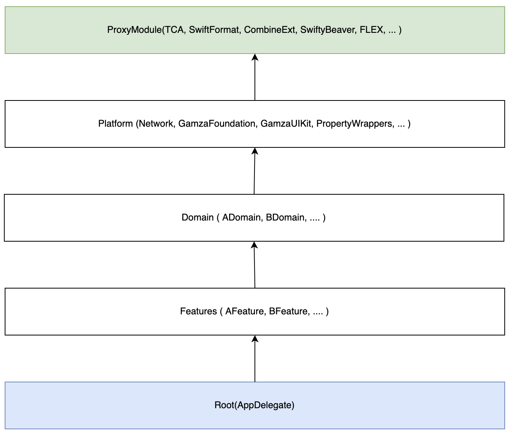
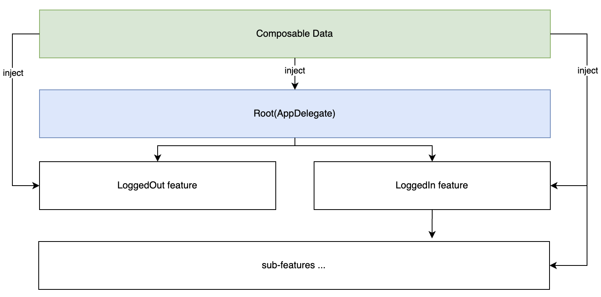

# 감자바다 - iOS

## Member
- [김기현](https://github.com/dev-wimes)
- [한석호](https://github.com/dp21125)

## Requirements
- iOS 15.0+  
- Swift 5.6  
- Xcode 13.4.1  

## Dependency
- TCA 0.38.1
- CombineExt 1.7.0
- Kingfisher 7.2.4
- SwiftFormat 0.49.11
- SwiftyBeaver 1.9.6
- FLEX 4.7.0

## Architecture

using TCA

### Module Architecture

### Feature Architecture concept

